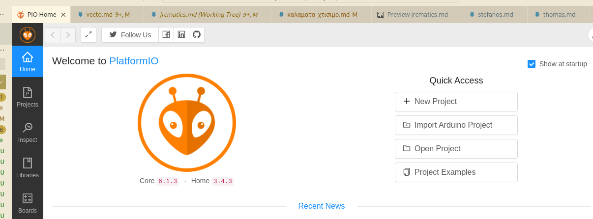
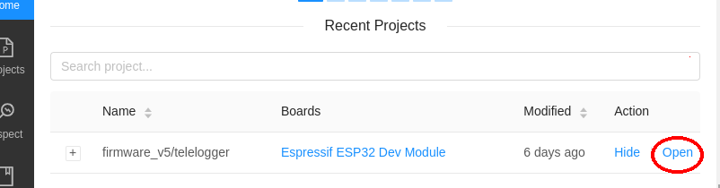
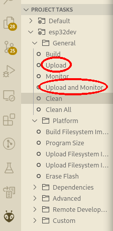

This Arduino sketch is designed for running on [Freematics ONE+](https://freematics.com/products/freematics-one-plus/) to collect vehicle telemetry data from OBD-II, GPS and motion sensor and transmit the collected data to a remote server running [Freematics Hub](https://freematics.com/hub) software in realtime. It also has a mechansim for executing and responding to commands sent from serverside.

Installation
============

Prerequisites
-------------

* [Freematics ONE+](https://freematics.com/products/freematics-one-plus/) or [Freematics ONE+ Model B](https://freematics.com/products/freematics-one-plus-model-b/)
* A micro SIM card if cellular network required (otherwise WiFi is ok)
* [Visual Studio Code (vscode)](https://code.visualstudio.com/)
* [PlatformIO](http://platformio.org/) vscode-extension for compiling and uploading;
  this directory contains its `.pio/` configuration folder


Installation steps
------------------

1. Read the `README.md` at the base of the repo for instructions on how to
   git-clone this repo *sparsingly* for this folder - preferably use a `git` command
   in a separate terminal (not from within *vscode*)

2. Ensure the *plaformio* has been installed

3. Use vscode's "File|Open folder" menuitem to select and open this project's
   sub-directory `firmware_v5/telelogger`.
   

   At that point your should have a vscode window opened as *vscode workspace*
   properly located on this project directory and the *platformio* extension
   should have detected the `.pio/` folder and after some time,
   the *platformio UI* must have been activated in a tab (shown in the image, right).

4. From the *platform UI* select the `firmware_v5/telelogger` project to open it.
   

   This should take some time to download dependencies, until the build/upload
   items from the left-sidebar appear.

5. Review configurations in `config.h` and customize them to your settings
   with a `secrets.h` overlay file (process as explained in the header of `config.h`).

6. Connect the device in a usb port and click "upload" from the left-sidebar.
   

<br clear=all>

> **ATTENTION:** if you work on *Windows-10* or *Windows-11-without-symlinks*,
the **monitor** command would not work, and will print an error instead:
>
> ```txt
> Error: Traceback (most recent call last):
>   File "${HOME}/.platformio/penv/lib/python3.10/site-packages/platformio/__main__.py", line 102, in main
>     cli()  # pylint: disable=no-value-for-parameter
> ...
>   File "<frozen importlib._bootstrap_external>", line 883, in exec_module
>   File "<frozen importlib._bootstrap>", line 241, in _call_with_frames_removed
>   File "${HOME}/Work/JRCMATICS.git/firmware_v5/telelogger/monitor/filter_freestate.py", line 1, in <module>
>     ../freestate.py
> NameError: name '../freestate.py' is not defined
>
> ============================================================
>
> An unexpected error occurred. Further steps:
>
> * Verify that you have the latest version of PlatformIO using
>   `pip install -U platformio` command
>
> * Try to find answer in FAQ Troubleshooting section
>   https://docs.platformio.org/page/faq/index.html
>
> * Report this problem to the developers
>   https://github.com/platformio/platformio-core/issues
>
> ============================================================
>
>
>  *  The terminal process "platformio 'device', 'monitor'" terminated with exit code: 1.
> ```

> Read [this SO question](https://stackoverflow.com/questions/5917249/git-symbolic-links-in-windows) on how to enable symlinks on Windows,
> and ensure a proper git-checkout of the project
>
> Otherwise, you can issue the following commands to "copy" the offending filter files
> that failed to symlink into `firmware_v5/telelogger/monitor/`
> (assuming you are in the ``firmware_v5/telelogger/` directory):
>
> ```bash
> cp freestate.py monitor/filter_
> cp macroflags.py monitor/filter_macroflags.py
> ```
>
> ...and remember NOT to commit those files in `monitor/`.


Data Collection
===============

The sketch collects following data.
* Vehicle OBD-II PIDs data (from OBD port)
* Battery voltage (from OBD port)
* Geolocation data (from cellular module's internal GNSS or external GNSS receiver)
* Acceleration and gyroscope data (from internal MEMS sensor)
* Device temperature (from MEMS sensor or ESP32 built-in sensor)

Data Transmissions
==================

Data transmission over UDP and HTTP protocols are implemented with following hardware.

* WiFi (ESP32 built-in)
* WiFi Mesh (ESP-MDF for ESP32)
* GSM/GPRS (SIM800)
* 3G WCDMA (SIM5360)
* 4G LTE (SIM7600)

There two ways of sending data:

1. UDP mode implements a full telemetry client for [Freematics Hub](https://freematics.com/hub/)
   and [Traccar](https://www.traccar.org) (sends more data, [protocol's API](https://freematics.com/pages/hub/api/), uses 5170 port).
2. HTTP/HTTPS mode implements a `osmand` protocol client for Traccar
   (sends only location data, [protocol's API](https://www.traccar.org/osmand/),
   uses 5055 port)

Data Storage
============

Following types of data storage are supported.

* MicroSD card storage
* ESP32 built-in Flash memory storage (SPIFFS)

Buzzer notes & patterns
=======================
The device produces the following buzzing-sounds (when `ENABLE_BUZTICKS`):

- 1Hz tick: immediately after boot, while in `setup()` & before `initialize()`;
  hence while `BOOT_OBD_PIPE_TIMEOUT_SEC` mode is enabled.
  Occurs again if "reboot" from standby configured.
- 2Hz ta-tick: `initialize()`; always follows boot, and wake-up from standby
  (even if no "reboot" from standby configured).
- 1Hz ta-tick: while waiting to reconnect, after multiple attempts to login.

Remote Commands
===============

Commands can be sent to Freematics ONE+ for execution with results obtained, through serial terminal or by [Freematics Hub API](https://freematics.com/hub/api/) (remotely). Currently following commands are implemented.


- `LED [0/1/2]`

  set device LED status (0:auto 1:always off 2:always on)

- `REBOOT`

  perform a reboot immediately

- `STANDBY`

  enter standby mode immediately (until motion or voltage spike detected)

- `WAKEUP`

  wake up the device from standby mode

- `STATS`

  return some stats

- `OBD <AT-command>`

  send given ELM327 command to co-processor connected to OBD-II and await result

- `OTA [URL]`

  upgrade firmware from default or given url

- `SET OTABOOT <0|1>`

  set next OTA partition to boot (but do not reboot)

- `INFO[<source>]`

  dump specified node infos as JSON, where `source` is one of:

  - `H`: hardware
  - `F`: firmware
  - `S`: status
  - `C`: configs
  - `*`: all [default]


Example API calls
-----------------

Send OTA command through the *teleserver* with your browser like this:

    <teleserver-url>/api/command?id=DEVICEID&cmd=OTA

Switch which OTA partition to boot & reboot:

    <teleserver-url>/api/command?id=DEVICEID&cmd=SET%20OTABOOT%201
    <teleserver-url>/api/command?id=DEVICEID&cmd=REBOOT

To read command results, extract the "token" from the JSON response (eg. `3`)
and send it:

    <teleserver-url>/api/command?id=DEVICEID&token=3

> **NOTE:** as of July 2022, reading back cmd results does not seem to work.

Viewing Trip Data
=================

Once the sketch is running and data is being submitted to hub.freematics.com, you can open https://hub.freematics.com from any of your devices and enter your device ID (displayed in serial output) to view real-time data and history trip data.


